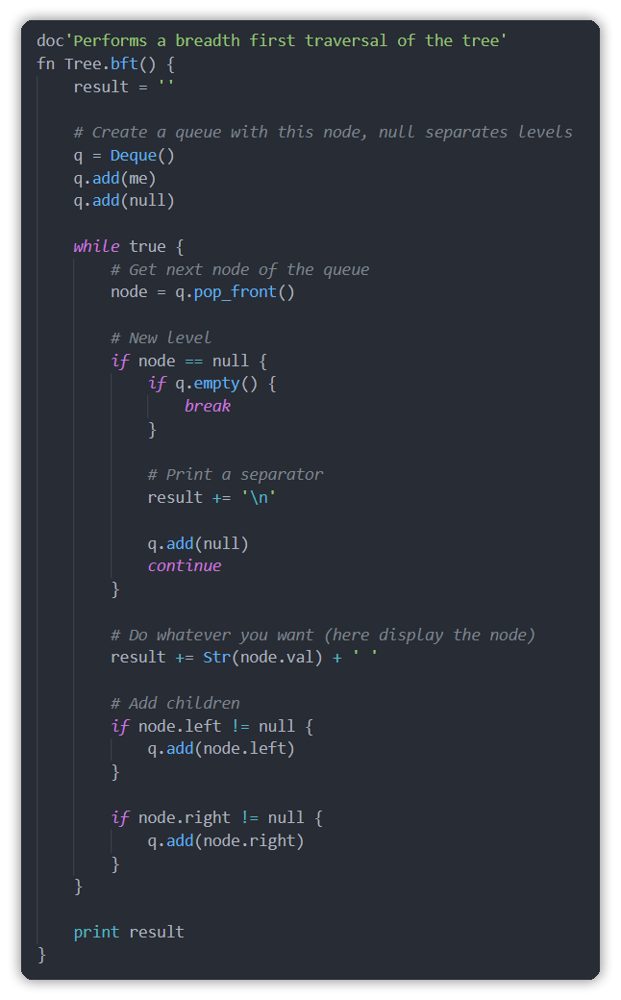
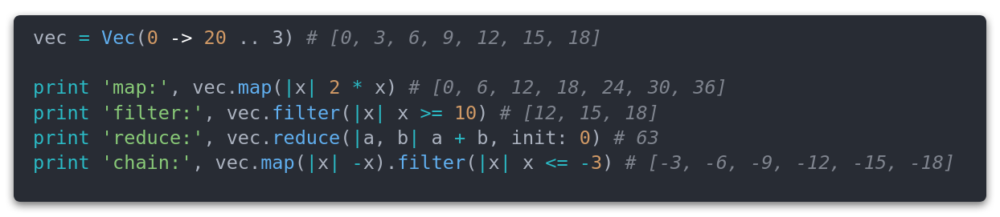

<a href="https://github.com/Cc618/Riddim">
<p align="center">

</p>
</a>

# Riddim
Riddim is an interpreted language designed for algorithms and data structures.

Riddim is written in C++ and uses Flex / Bison for parsing.
It provides also a standard library written in both C++ and Riddim.
Furthermore, it includes a documentation generator fully written in Riddim.

## Summary
- [⭐ Overview](#Overview)
- [☘️ Features](#Features)
- [🔌 Installation](#installation)
- [📚 Documentation](#Documentation)
- [⚖ License](#License)

## Overview
- Look at some [examples](examples/README.md)
- Take a look at [Riddim's syntax specification](docs/riddim/syntax.md)
- [Online Documentation](https://cc618.github.io/Riddim)

<a href="examples/tree.rid">
<p align="center">

</p>
</a>

<a href="examples/collections.rid">
<p align="center">

</p>
</a>

## Features
Riddim is designed for algorithms, the goal is to provide an easy and readable code.

- It provides a modular **standard library** with powerful collections (vectors, maps, iterators, segment trees...) and algorithms (map, reduce, binary search...)
- An **auto documentation** tool is included
- **Garbage collection** is used for memory management
- **Error handling** is easy with try / catch blocks
- **Lambdas** can be used instead of functions
- **Internals** like garbage collection / interpreter are inspired by Python
- The **syntax** is inspired by multiple C-like languages (with a pinch of Python)

## <span id="installation">Configure / build / install</span>
Here is the single command to install Riddim :
```sh
./configure.sh && sudo scripts/install.sh
```

### Configuration
For more details about the configure script, check the [config documentation](docs/riddim/config.md).

The [configure.sh](configure.sh) script can be modified for a custom config
(to install riddim in a custom directory / build in debug mode for example) :
```sh
./configure.sh
```

This will create the build folder with the Makefile.

### Build
After the configuration, the Makefile is located in the build folder.
```sh
cd build && make -j 4
```

**build/src/riddim** is the output of the build.

### Installation
After the configuration script executed, it is possible to build and install
Riddim with the script [scripts/install.sh](scripts/install.sh).

Note that by default, the outputs will be copied to system directories so
a root privilege may be necessary.

```sh
# You can omit sudo if you configured a non system directory
sudo scripts/install.sh
```

### Uninstallation
There is also an uninstallation script.
If you used a custom configuration, source
it before uninstalling riddim.

```sh
# If you have a custom configuration
source configure.sh
# sudo may be useless if you have a custom configuration
sudo scripts/uninstall.sh
```

## Documentation
The documentation can be seen on [Github](docs) or via the [Documentation Website](https://cc618.github.io/Riddim).

## License
Riddim is licensed under the [MIT License](LICENSE)
